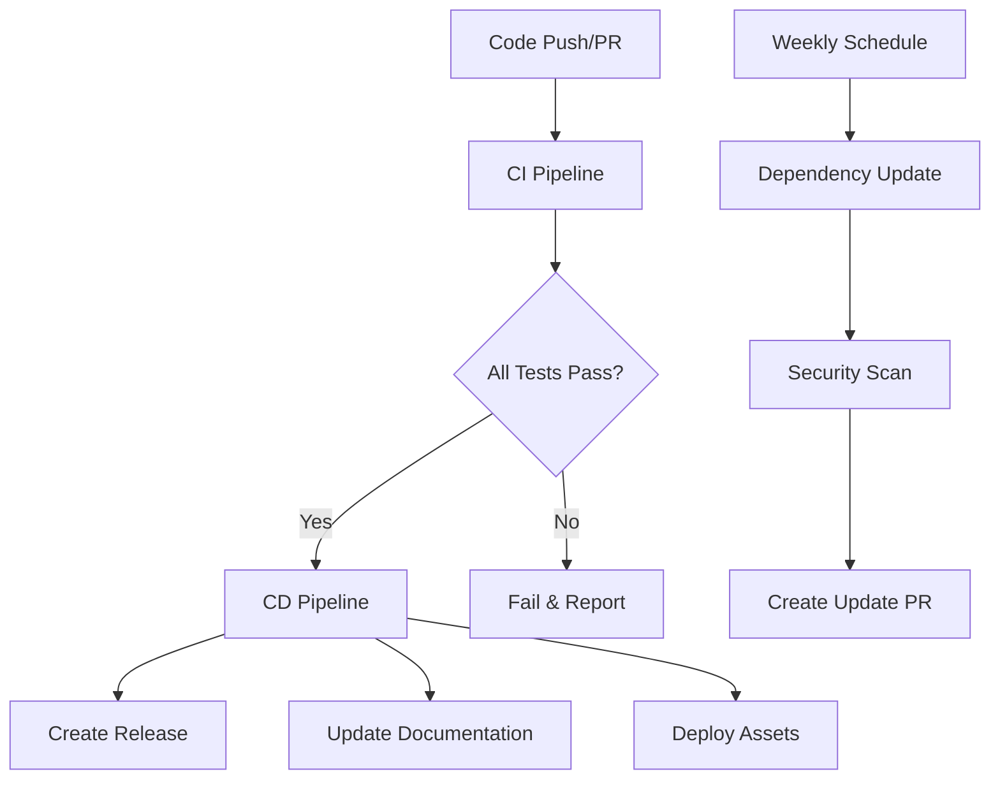

# CI/CD Pipeline Documentation

This repository includes comprehensive CI/CD pipelines that automatically run on every code change, ensuring code quality, security, and reliability.

## 🚀 Pipeline Overview

### **CI Pipeline** (`ci.yml`)
- **Triggers**: Push to main/develop, Pull Requests
- **Purpose**: Continuous Integration testing
- **Features**:
  - Multi-Python version testing (3.8, 3.9, 3.10, 3.11)
  - Multi-OS testing (Ubuntu, macOS, Windows)
  - Code linting and formatting checks
  - Security audits with Bandit and Safety
  - Notebook execution testing
  - Dependency caching for faster builds

### **CD Pipeline** (`cd.yml`)
- **Triggers**: Successful CI completion on main branch
- **Purpose**: Continuous Deployment
- **Features**:
  - Automatic release creation
  - Asset packaging and distribution
  - Documentation updates
  - Deployment notifications

### **Test Matrix** (`test-matrix.yml`)
- **Triggers**: Push/PR to main/develop, Weekly schedule
- **Purpose**: Comprehensive testing across environments
- **Features**:
  - Cross-platform testing
  - Dependency version matrix testing
  - Integration testing
  - Test result artifacts

### **Code Quality** (`code-quality.yml`)
- **Triggers**: Push/PR to main/develop
- **Purpose**: Code quality and style enforcement
- **Features**:
  - Black code formatting
  - isort import sorting
  - flake8 linting
  - mypy type checking
  - pylint analysis
  - Code complexity metrics
  - Auto-formatting on main branch

### **Dependency Management** (`dependency-update.yml`)
- **Triggers**: Weekly schedule, Manual dispatch
- **Purpose**: Dependency updates and security scanning
- **Features**:
  - Outdated package detection
  - Automatic PR creation for updates
  - Security vulnerability scanning
  - Safety, Bandit, and pip-audit integration

## 🔧 Setup Instructions

### 1. **Repository Secrets**
Configure these secrets in your GitHub repository settings:

```bash
# Snowflake Connection (for integration tests)
SNOWFLAKE_PASSWORD
SNOWFLAKE_USER
SNOWFLAKE_ACCOUNT
SNOWFLAKE_ROLE
SNOWFLAKE_WAREHOUSE
SNOWFLAKE_DATABASE
SNOWFLAKE_SCHEMA

# GitHub Token (automatically provided)
GITHUB_TOKEN
```

### 2. **Branch Protection Rules**
Set up branch protection for `main` and `develop`:
- Require status checks to pass
- Require branches to be up to date
- Require pull request reviews
- Restrict pushes to matching branches

### 3. **Required Status Checks**
Enable these status checks as required:
- `CI Pipeline`
- `Code Quality`
- `Test Matrix`

## 📊 Pipeline Workflow



## 🧪 Testing Strategy

### **Unit Tests**
- Notebook syntax validation
- Import testing
- Basic functionality checks

### **Integration Tests**
- Snowflake connectivity
- End-to-end workflows
- Cross-chapter dependencies

### **Quality Tests**
- Code formatting (Black)
- Import sorting (isort)
- Linting (flake8, pylint)
- Type checking (mypy)
- Complexity analysis (radon, mccabe)

### **Security Tests**
- Dependency vulnerability scanning (Safety)
- Code security analysis (Bandit)
- Package security audit (pip-audit)

## 📈 Monitoring and Reporting

### **Artifacts Generated**
- Test results and logs
- Security reports
- Complexity analysis
- Coverage reports

### **Notifications**
- Pull Request comments with quality metrics
- Deployment success notifications
- Security vulnerability alerts
- Dependency update PRs

## 🚨 Troubleshooting

### **Common Issues**

1. **Pipeline Fails on Notebook Tests**
   - Check Snowflake credentials
   - Verify notebook syntax
   - Ensure all dependencies are installed

2. **Code Quality Checks Fail**
   - Run `black .` locally to format code
   - Run `isort .` to sort imports
   - Fix linting issues reported by flake8

3. **Security Scans Fail**
   - Review vulnerability reports
   - Update vulnerable dependencies
   - Check for hardcoded secrets

### **Local Development**

```bash
# Install development dependencies
pip install -r requirements.txt
pip install black flake8 isort mypy pylint

# Run quality checks locally
black --check .
isort --check-only .
flake8 .
mypy . --ignore-missing-imports

# Auto-fix formatting issues
black .
isort .
```

## 🔄 Pipeline Triggers

### **Automatic Triggers**
- **Push to main/develop**: Full CI/CD pipeline
- **Pull Request**: CI and quality checks
- **Weekly schedule**: Dependency updates and security scans

### **Manual Triggers**
- **Workflow dispatch**: Manual pipeline execution
- **Release creation**: Manual deployment triggers

## 📋 Best Practices

### **For Developers**
1. Always run quality checks locally before pushing
2. Use feature branches for development
3. Keep PRs small and focused
4. Respond to CI feedback promptly

### **For Maintainers**
1. Monitor pipeline health regularly
2. Review security reports weekly
3. Update dependencies monthly
4. Maintain branch protection rules

### **For DevOps**
1. Monitor pipeline performance
2. Optimize caching strategies
3. Scale runners as needed
4. Implement monitoring and alerting

## 🎯 Performance Metrics

### **Target Metrics**
- **Build Time**: < 10 minutes
- **Test Coverage**: > 80%
- **Security Issues**: 0 critical/high
- **Code Quality**: A+ grade

### **Monitoring Tools**
- GitHub Actions insights
- Pipeline execution logs
- Artifact analysis
- Performance dashboards

## 🔗 Related Resources

- [GitHub Actions Documentation](https://docs.github.com/en/actions)
- [Python Testing Best Practices](https://docs.pytest.org/)
- [Code Quality Tools](https://black.readthedocs.io/)
- [Security Scanning](https://bandit.readthedocs.io/)

## 📞 Support

For pipeline issues or questions:
1. Check the Actions tab in GitHub
2. Review pipeline logs for errors
3. Create an issue with detailed error information
4. Tag maintainers for urgent issues

---

**Last Updated**: $(date)
**Pipeline Version**: 1.0.0
**Maintainer**: CI/CD Team
